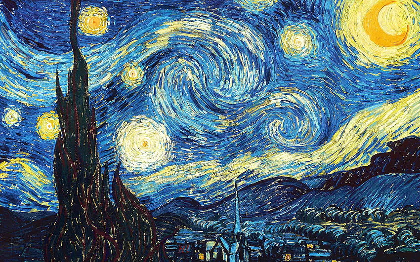

# Tolgahan Özdemir
*AI Engineer | Deep Learning & LLM Systems*

Welcome. I am an AI Engineer with a strong foundation in Computer Engineering, specializing in the research, development, and deployment of complex AI architectures. My work bridges predictive healthcare algorithms, large language models, and autonomous ecosystems.

### Research & Engineering Focus
My development philosophy centers on building scalable, interpretable, and production-ready AI models. Rather than just training algorithms, I focus on end-to-end integration and real-world utility. My active areas of interest include:

- **Explainable AI (XAI) in Healthcare:** Designing clinical decision support systems where model transparency (e.g., utilizing SHAP) and reliability are just as critical as predictive accuracy.
- **LLM Integrations & Risk Analysis:** Exploring the use of generative AI and multi-model consensus mechanisms to automate complex data analysis, anomaly detection, and risk scoring pipelines.
- **Computer Vision & Autonomous Systems:** Developing robust, real-time object detection and segmentation architectures for dynamic environments and edge applications.

### Technical Repertoire

 
 
 
 
 
 
 
 
 
 

### Contact
- **Email:** tolgahanozdemir7@gmail.com
- **Portfolio:** [tolgahan-ai.vercel.app](https://tolgahan-ai.vercel.app/)
- **LinkedIn:** [tolgahan-özdemir-492068252](https://linkedin.com/in/tolgahan-%C3%B6zdemir-492068252)
- **Resume / CV:** [View My Resume](https://tolgahanozdemir7.github.io/tolgahanozdemir46.github.io/tolgahan_ozdemir_3.pdf)

  
  

